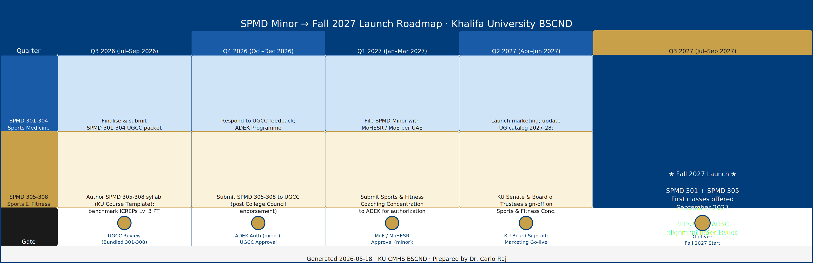
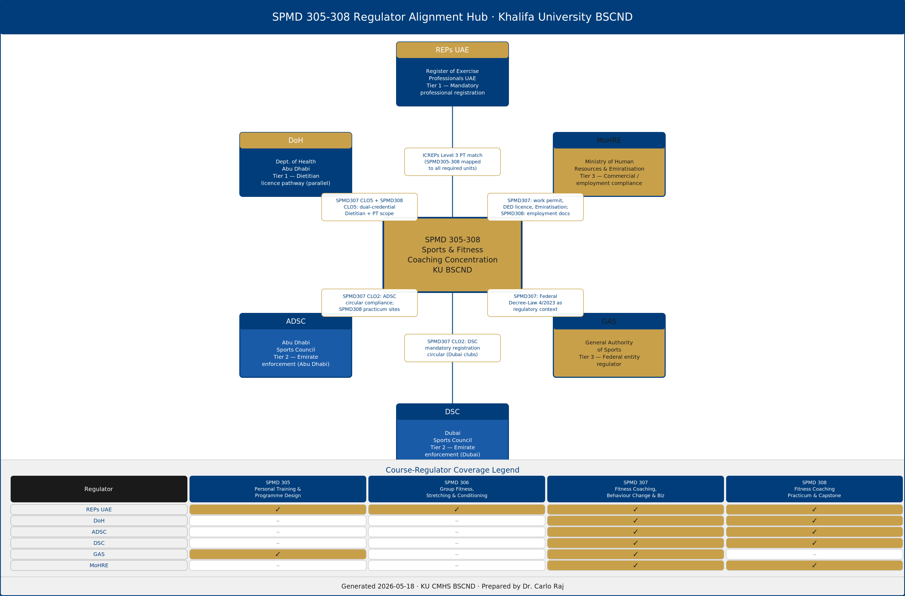

# SPMD Minor → Fall 2027 ADEK Roadmap

**Khalifa University CMHS · BSc Clinical Nutrition & Dietetics**
**Prepared by Dr. Carlo Raj · 2026-05-18 · ADEK-aligned**

> Two-track Sports Medicine offering within the BSCND programme.
> Single `_data.json` source-of-truth powers every downstream artifact.

**🔬 Live NotebookLM:** [BSCND SPMD Fall 2027 Roadmap (ADEK)](https://notebooklm.google.com/notebook/43d96428-6ac5-4861-8f2b-10bdc9d734f1) — 13 sources uploaded (3 Habiba PDFs, 4 SPMD syllabi, generated briefing + study guide + Q&A pack, roadmap doc, PHYSICAL MANAGER program plan, FitnessCoach licensure integration). Ask the corpus questions directly in the NotebookLM web UI.


### 🎯 Dual-Track Pathway — NotebookLM Infographic


*Generated by NotebookLM from the 13-source corpus on 2026-05-18. Detailed landscape rendering of the two-track program, courses with objectives, dual-credential outcome, regulator alignment, and 5-quarter launch timeline.*

---

## Programme Overview

| Attribute | Value |
|---|---|
| Programme | BSc Clinical Nutrition & Dietetics (BSCND) |
| Institution | Khalifa University of Science and Technology |
| College | College of Medicine and Health Sciences (CMHS) |
| Target Launch | Fall 2027 (September 2027) |
| QF Emirates Level | 6 |
| Baseline Credits | 124 |
| Credits with Concentration | 136 |
| Audience | ADEK reviewers |

### Two Tracks (30 credits total)

| Track | Codes | Credits | Status | ICREPs eligible |
|---|---|---|---|---|
| Sports Medicine Minor | SPMD 301, 301a, 302, 302a, 303, 304 | 18 | Pending UGCC review | No |
| Sports & Fitness Coaching Concentration | SPMD 305, 306, 307, 308 | 12 | Proposed (syllabi not yet authored) | Yes — ICREPs Level 3 PT |

> **Note:** SPMD 301a (Sports Anatomy & Injury Mechanics) and SPMD 302a (Exercise Physiology Lab) were added 2026-05-18 per Kinda Khalaf's request for an 18-credit strengthened minor. Both are `_inferred: true` — faculty validation pending.

---

## Q×T×G Matrix (Quarter × Track × Gate)



| Quarter | Dates | Minor Deliverable | Concentration Deliverable | Gate |
|---|---|---|---|---|
| Q3 2026 | Jul–Sep 2026 | Finalise and submit consolidated UGCC packet for SPMD 301-304 | Author SPMD 305-308 syllabi; benchmark against ICREPs Level 3 PT | UGCC review (bundled submission) |
| Q4 2026 | Oct–Dec 2026 | Respond to UGCC feedback; prepare ADEK Program Authorization draft | Submit SPMD 305-308 to UGCC following CMHS College Council endorsement | ADEK Program Authorization (minor); UGCC approval (concentration) |
| Q1 2027 | Jan–Mar 2027 | File SPMD Minor with MoHESR / Ministry of Education | Submit Sports & Fitness Coaching Concentration to ADEK | MoE / MoHESR approval (minor); ADEK intake of concentration |
| Q2 2027 | Apr–Jun 2027 | Launch marketing; update undergraduate catalog 2027-28 | KU Senate and Board of Trustees sign-off on Concentration | KU Senate / Board sign-off; marketing go-live |
| Q3 2027 | Jul–Sep 2027 | SPMD 301 first class offered — September 2027 | SPMD 305 + 306 first classes offered — September 2027 | Go-live — Fall 2027 semester start + REPs UAE / ADSC alignment letter |

---

## Regulator Alignment



Six UAE regulatory bodies aligned to the Concentration courses (SPMD 305–308):

| Body | Tier | Relevance |
|---|---|---|
| REPs UAE | Tier 1 — Primary professional registration | Mandatory registration for UAE exercise professionals; SPMD 305-308 closes all ICREPs Level 3 PT gaps |
| ADSC | Tier 2 — Emirate (Abu Dhabi) enforcement | Abu Dhabi clubs require REPs UAE registration; practicum placements in ADSC-overseen facilities |
| DSC | Tier 2 — Emirate (Dubai) enforcement | Originator of REPs UAE; graduates with REPs UAE ID card compliant |
| GAS | Tier 3 — Federal strategic | Federal Decree-Law No. 4/2023; sports as national priority sector |
| DoH Abu Dhabi | Tier 1 — Dietitian licence | Parallel credential pathway for BSCND graduates |
| MoHRE | Tier 3 — Commercial/employment | Work permit and trade licence for self-employed fitness coaches |

---

## Artifact Paths

| Artifact | Path |
|---|---|
| Source of truth | `_data.json` |
| Corpus extracts | `corpus_extracts.json` |
| Word document (.docx) | `docs/SPMD_Fall2027_Roadmap.docx` |
| Excel workbook (.xlsx) | `docs/SPMD_Fall2027_Roadmap.xlsx` |
| HTML report | `docs/SPMD_Fall2027_Roadmap.html` |
| Build scripts | `docs/_build_docx.py`, `docs/_build_xlsx.py`, `docs/_build_html.py` |
| QTG Matrix (Excalidraw) | `diagrams/qtg_matrix.excalidraw` |
| QTG Matrix (SVG) | `diagrams/qtg_matrix.svg` |
| QTG Matrix (PNG) | `diagrams/qtg_matrix.png` |
| Regulator Alignment (Excalidraw) | `diagrams/regulator_alignment.excalidraw` |
| Regulator Alignment (SVG) | `diagrams/regulator_alignment.svg` |
| Regulator Alignment (PNG) | `diagrams/regulator_alignment.png` |
| Briefing PDF | `notebooklm/briefing.pdf` |
| Study Guide PDF | `notebooklm/study_guide.pdf` |
| Q&A Pack PDF | `notebooklm/qa_pack.pdf` |
| Mind Map PNG | `notebooklm/mind_map.png` |
| Audio narration (placeholder) | `notebooklm/audio_overview.mp3` |
| React/Vite microsite source | `microsite/src/` |
| Microsite dist | `microsite/dist/` |
| Reusable pipeline skill | `skills/spmd-roadmap-pipeline/SKILL.md` |

---

## Quick Start — Microsite Locally

```bash
cd microsite
npm install
npm run dev
# Open http://localhost:5173
```

The microsite reads `_data.json` at runtime via `fetch('/_data.json')`.
After updating `_data.json`, just copy it to `microsite/public/_data.json` and `microsite/dist/_data.json` — no rebuild needed.

### Deploy to Lovable

```bash
# From the microsite directory:
npx lovable deploy
# or push to GitHub and connect at https://lovable.dev
```

Lovable deploy URL: *(pending — see Wave 3 step 2C)*

---

## Regenerate All Artifacts

After editing `_data.json`:

```bash
# Step 1: Rebuild docs
cd docs
python3 _build_docx.py
python3 _build_xlsx.py
python3 _build_html.py

# Step 2: Update microsite data (no rebuild needed)
cp _data.json microsite/public/_data.json
cp _data.json microsite/dist/_data.json

# Step 3: Regenerate NotebookLM-equivalent artifacts
cd notebooklm
python3 gen_briefing.py
python3 gen_study_guide.py
python3 gen_qa_pack.py
python3 gen_mindmap.py
# python3 gen_audio.py  # requires valid ElevenLabs API key

# Step 4: Regenerate Excalidraw diagrams
cd ..
python3 build_scene1.py
python3 build_scene2.py
```

---

## Status & Known Issues

- SPMD 301a + 302a are `_inferred: true` — faculty must validate before UGCC submission
- SPMD 305-308 CLOs and PLO mappings are inferred — syllabi not yet authored
- Audio narration (`notebooklm/audio_overview.mp3`) is a placeholder — requires valid ElevenLabs API key to regenerate
- NotebookLM upload pending: run `uvx --from notebooklm-skill notebooklm login` then restart Claude Code
- Lovable deploy URL: pending (run `npx lovable deploy` from `microsite/`)

---

## Pipeline

Generated by a 7-agent Claude Code pipeline (2026-05-18):

- **Wave 1 (A1):** Corpus extraction → `_data.json` + `corpus_extracts.json`
- **Wave 2 (A3–A6, parallel):** Excalidraw infographics | Python doc pipeline | React/Vite microsite | NotebookLM-equivalent artifacts
- **Wave 3 (A7):** 18-credit regen + GitHub + Obsidian + skill + memory persistence

---

*Prepared by Dr. Carlo Raj · Khalifa University CMHS · 2026-05-18 · ADEK-aligned*
